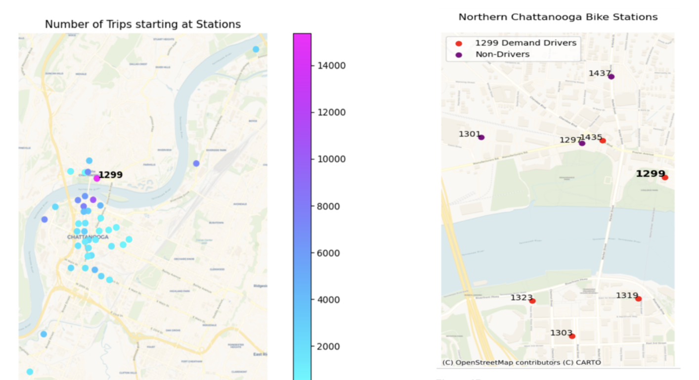

# chattanooga-bike-sharing
Forecasting bike demand in the City of Chattanooga

The aim of this study is to forecast bike demand in the City of Chattanooga, specifically the change in bike inventory at every hour at popular bike dock stations. Chattanooga, Tennessee, USA launched its bike sharing system, called "Bike Chattanooga," in July 2012. Initially offering 30 stations and 300 rental bikes, Bike Chattanooga has subsequently grown to 42 stations and more than 400 bikes. Chattanooga’s bike sharing program is particularly interesting because it was established in collaboration with Outdoor Chattanooga, an outdoor center that is a main attraction for tourists. This means that the city has a lot to gain in terms of tourist ridership by balancing demand at the stations near Outdoor Chattanooga and the partnership could ease with bike redistribution by taking advantage the center’s staff on ground. For this reason, Bike Chattanooga is an ideal example of how improving operations from demand predictions could be very advantageous for cities.

This Repo contains notebooks for 
- Exploratory data analysis
- SARIMA model
- Vector Autoregressive Model
- Random Forest Model
- RNN: LSTM

